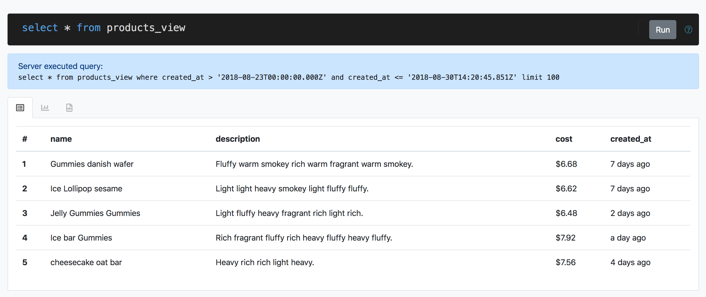
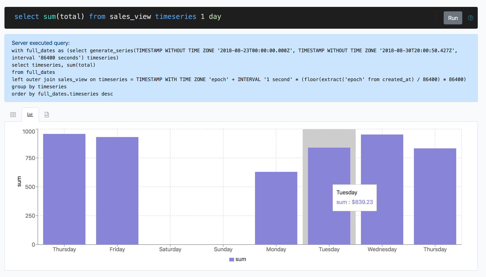
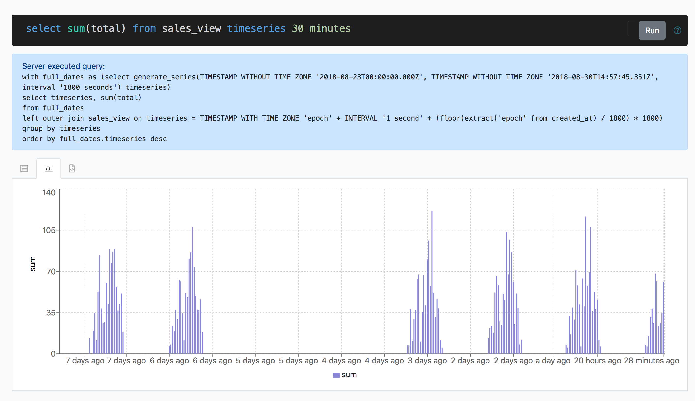
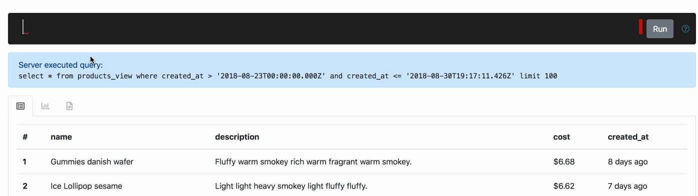
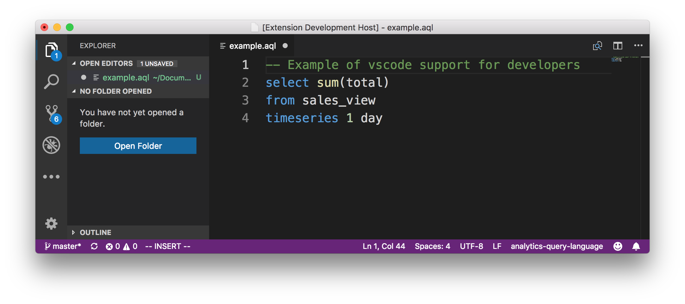

# Language Plugins

This repository represents a spike into writing language plugins for vscode / monaco, using a simple
SQL-like language AQL (Analytics Query Language) as the proof of concept language.

An example query may be:

```sql
select count(*)
from sales_view
where cost > 5
since tuesday at '08:00'
until today at '12:00'
```

Note - this project is not production-ready code, and is simply a proof of concept.

# In Action

At the heart of this project is a simple SQL-like language, AQL (Analytics Query Language). This language
allows you to explore your company's data and see either the raw data, or various graphs based on the data.

## Tabular data

You can choose to view the data in its tabular format:



## Time series support

You can also choose to explore your data over time as a time series. For instance seeing the total sales value on a per
day basis:



This time period is also configurable. For instance, showing the timeseries for the total sales value every 30 minutes:



## Exploration

Both the vscode plugin and web application provides auto-completion and error highlighting, which should make the language
more approachable. The auto-completion in particular should help provide access to all of the available data model attributes and
language functionality:



## vscode support

The theory is that a developer would make use of the same query language to create custom dashboards for users.
This would work using the same declarative approach taken by GraphQL + Apollo's React integration. For this reason
the language support is also added as a vscode plugin:



# Running

## Web Application

For the web The easiest way to get up and running is to use docker + docker-compose:

```
docker-compose build
docker-compose up
```

The web application should now be accessible at http://localhost:3000/

# Notes

## VSCode / Monaco

- vscode and monaco have different APIs, and are [not compatible](https://github.com/Microsoft/monaco-editor/issues/430)
- vscode uses text mate for syntax highlighting, whilst monaco uses its own custom json format for
  syntax highlighting
- monaco currently connects to the language server via websockets. This would potentially impact
  deploy procedures.

## Parsing / Error handling

- ANTLR is pretty awesome, it can generate various clients
- ANTLR doesn't support incremental parsing. That shouldn't be an issue for such a small query
  language though.
- I'm still on the fence about a hand rolled parser for better error handling, or investigating
  [Menhir](http://gallium.inria.fr/~fpottier/menhir/)

## Database considerations

- The database should be read only
- Instead of being queried on demand, the information could be pre-aggregated
- Performance may depend massively on sharding of data
- The queries should run under a user account with limited permissions
- There should be semantic verification of the schema to ensure that the user doesn't generate valid
  AQL->SQL transformations, that would provide access to other individual's data
- It's not possible to explicitly coerce data types in AQL, meaning the AQL -> SQL layer could help
  the end user out with data coercion, i.e. for averaging money fields

# Useful Resources

## Language Design

- https://www.amazon.co.uk/Definitive-ANTLR-4-Reference/dp/1934356999
- https://groups.google.com/forum/?fromgroups#!topic/antlr-discussion/JxTED3XeZuE
- https://github.com/mike-lischke/antlr4-c3
- https://blog.rapid7.com/2015/06/29/how-to-implement-antlr4-autocomplete/

## Monaco / VSCode

- https://code.visualstudio.com/docs/extensions/yocode
- https://github.com/Microsoft/vscode-extension-samples
- https://microsoft.github.io/monaco-editor/monarch.html
- https://tomassetti.me/language-server-dot-visual-studio/
- http://typefox.io/teaching-the-language-server-protocol-to-microsofts-monaco-editor

## Postgres Fun

- https://dba.stackexchange.com/questions/75015/query-to-return-output-column-names-and-data-types-of-a-query-table-or-view
- https://chartio.com/learn/sql/random-sequences/
- https://www.postgresql.org/docs/10/static/index.html
